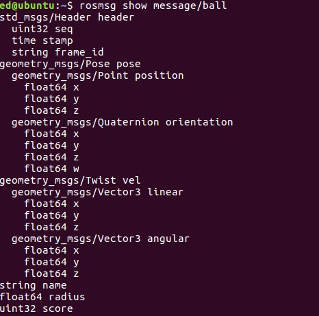

# ROS_MESSAGE
## 說明

自訂義ROS meaasge格式。

## 使用

### 編譯

```
cd ~/catkin_ws && catkin_make
```

### 執行

```
roslaunch message msg.launch 
rostopic list
rostopic echo /ball
rostopic echo /ballArray
```

### 資訊

```
rostopic info /ball
rostopic info /ballArray
```

```
rosmsg show message/ball
rosmsg show message/ballArray
```




## 參考

[turtorial](http://wiki.ros.org/ROS/Tutorials/CreatingMsgAndSrv)

## 注意 
再新增自定義的message時，如果出現`rerun cmake`等的錯誤題示時，可以執行。

```
cd ~/catkin_ws && catkin_make -j1
```

